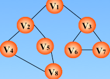

# 图

- [图](#图)
    - [图的表示形式](#图的表示形式)
        - [代码实现(待做)](#代码实现待做)
    - [遍历(重点)](#遍历重点)
        - [DFS](#dfs)
        - [BFS](#bfs)
    - [最短路径](#最短路径)
        - [Dijkstra(迪杰斯特拉)(待做)](#dijkstra迪杰斯特拉待做)
        - [Floyd(弗洛伊德)(待做)](#floyd弗洛伊德待做)
    - [最小生成树](#最小生成树)
        - [Prim(克鲁姆)(待做)](#prim克鲁姆待做)
        - [Kruskal(克鲁斯卡尔)(待做)](#kruskal克鲁斯卡尔待做)

## 图的表示形式

图的表示方式有邻接矩阵和邻接表两种表示方法



```matlab
邻接矩阵表示法
[  (v1) (v2) (v3) (v4) (v5) (v6) (v7) (v8)
(v1) 0,  1,   1,   0,   0,   0,   0,   0,
(v2) 1,  0,   0,   1,   1,   0,   0,   0,
(v3) 1,  0,   0,   0,   0,   1,   1,   0,
(v4) 0,  1,   0,   0,   0,   0,   0,   1,
(v5) 0,  1,   0,   0,   0,   0,   0,   1,
(v6) 0,  0,   1,   0,   0,   0,   1,   0,
(v7) 0,  0,   1,   0,   0,   1,   0,   0,
(v8) 0,  0,   0,   1,   1,   0,   0,   0,
]
无向图邻接矩阵可压缩(使用上三角或下三角), vi的度为第i行1的个数

邻接表表示法
头结点 |data|firstarc|
尾结点 |adjvex|nextarc|
0  |v1| | -> |1| | -> |2|NULL|
1  |v2| | -> |3| | -> |4| | -> |0|NULL| 
2  |v3| | -> |5| | -> |6| | -> |0|NULL|
3  |v4| | -> |1| | -> |7|NULL|
4  |v5| | -> |1| | -> |7|NULL|
5  |v6| | -> |2| | -> |6|NULL|
6  |v7| | -> |2| | -> |5|NULL|
7  |v8| | -> |3| | -> |4|NULL|
```

### 代码实现(待做)

## 遍历(重点)

图的遍历分为深度优先遍历(DFS)和广度优先遍历(BFS)两种，是算法题的常用解法，也叫深度优先搜索与广度优先搜索，通常与动态规划相比较

### DFS
1、访问指定的起始顶点；
2、若当前访问的顶点的邻接顶点有未被访问的，则任选一个访问之；反之，退回到最近访问过的顶点；直到与起始顶点相通的全部顶点都访问完毕；
3、若此时图中尚有顶点未被访问，则再选其中一个顶点作为起始顶点并访问之，转 2； 反之，遍历结束。
```c++
//访问标志数组
int visited[MAX] = {0};
//用邻接表方式实现深度优先搜索(递归方式）
//v 传入的是第一个需要访问的顶点
void recursiveDFS(MGraph G, int v)
{
    //图的顶点的搜索指针
    ArcNode *p;
    //置已访问标记
    visited[v] = 1;
    //输出被访问顶点的编号
    printf("%d  ", v);
    //p指向顶点v的第一条弧的弧头结点
    p = G.vertices[v].firstarc;
    while (p != NULL)
    {
        //若p->adjvex顶点未访问,递归访问它
        if (visited[p->adjvex] == 0)
        {
            recursiveDFS(G, p->adjvex);
        }
        //p指向顶点v的下一条弧的弧头结点
        p = p->nextarc;
    }
}

//头结点和尾结点的结构体不一样，为了便于编写，忽略类型间的差异，均为ArcNode
void DFS(MGraph G, int v) {
    stack<ArcNode*> s;
    s.push(G.vertices[v]);
    while(! s.empty()) {
        ArcNode* p = s.top();
        s.pop();
        if(visited[p->adjvex] == 0) {
            visited[p->adjvex] = 1;
            printf("%d ", p->adjvex);
            for(ArcNode* next = p->nextarc; next != NULL; next = next->nextarc) {
                s.push(next);
            }
        }
    }
}
```

### BFS
从图的某一结点出发，首先依次访问该结点的所有邻接顶点 Vi1, Vi2, …, Vin 再按这些顶点被访问的先后次序依次访问与它们相邻接的所有未被访问的顶点，重复此过程，直至所有顶点均被访问为止。
```c++
#include <iostream>
#include<queue>
using namespace std;

const int MAX = 10;
//辅助队列的初始化，置空的辅助队列Q，类似二叉树的层序遍历过程
queue<int> q;
//访问标记数组
bool visited[MAX];
//图的广度优先搜索算法
void BFSTraverse(Graph G, void (*visit)(int v))
{
    int v = 0;
    //初始化访问标记的数组
    for (v = 0; v < G.vexnum; v++)
    {
        visited[v] = false;
    }
    //依次遍历整个图的结点
    for (v = 0; v < G.vexnum; v++)
    {
        //如果v尚未访问，则访问 v
        if  (!visited[v])
        {
            //把 v 顶点对应的数组下标处的元素置为真，代表已经访问了
            visited[v] = true;
            //然后v入队列，利用了队列的先进先出的性质
            q.push(v);
            //访问 v，打印处理
            cout << q.back() << " ";
            //队不为空时
            while (!q.empty())
            {
                //队头元素出队,并把这个出队的元素置为 u，类似层序遍历
                Graph *u = q.front();
                q.pop();
                //w为u的邻接顶点
                for (int w = FirstAdjVex(G, u); w >= 0; w = NextAdjVex(G,u,w))
                {
                    //w为u的尚未访问的邻接顶点
                    if (!visited[w])
                    {
                        visited[w] = true;
                        //然后 w 入队列，利用了队列的先进先出的性质
                        q.push(w);
                        //访问 w，打印处理
                        cout << q.back() << " ";
                    }//end of if
                }//end of for
            }//end of while
        }//end of if
    }// end of for
}
```

## 最短路径

### Dijkstra(迪杰斯特拉)(待做)

### Floyd(弗洛伊德)(待做)

## 最小生成树

### Prim(克鲁姆)(待做)

### Kruskal(克鲁斯卡尔)(待做)