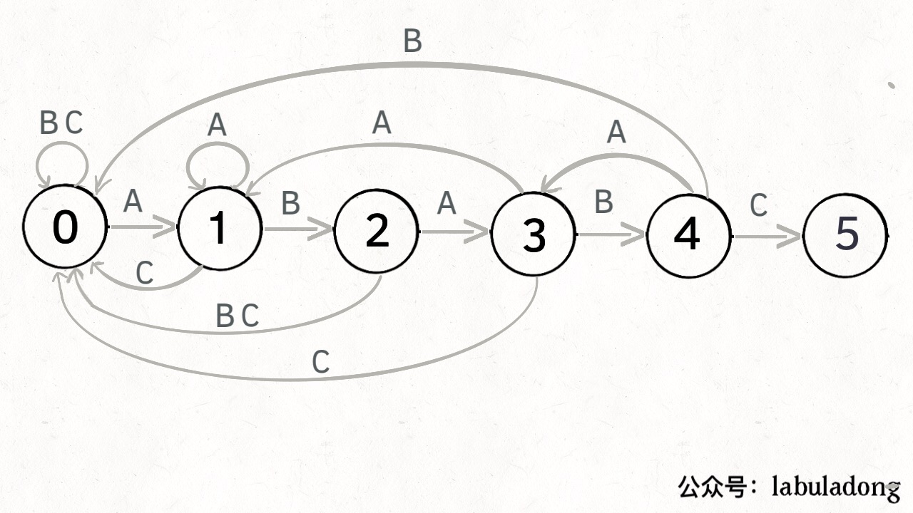

# 字符串

## KMP算法

根据模式串pattern构建确定有限状态机(只有pattern串有关)，对于不同的txt利用有限状态机在O(N)时间内完成字符串匹配



上图是"ABABC"模式串的状态转移图，用dp[i][j]来表示状态i遇到字符j时转移到的状态，当状态为5时，表示匹配结束

KMP算法的搜索部分

```cpp
public int search(String txt) {
    int M = pat.length();
    int N = txt.length();
    // pat 的初始态为 0
    int j = 0;
    for (int i = 0; i < N; i++) {
        // 当前是状态 j，遇到字符 txt[i]，
        // pat 应该转移到哪个状态？
        j = dp[j][txt.charAt(i)];
        // 如果达到终止态，返回匹配开头的索引
        if (j == M) return i - M + 1;
    }
    // 没到达终止态，匹配失败
    return -1;
}
```

KMP算法的核心在与如何从给定的模式串构造出转态转移数组dp[][],
* 利用辅助状态X，辅助状态X是与当前状态拥有最长前缀的状态
* 当前状态i遇到pattern[i]字符时，状态前进；当前状态遇到其他字符c时，等于辅助状态在c时的状态转换，即dp[i][c] = dp[X][c]

```cpp
public KMP(String pat) {
        this.pat = pat;
        int M = pat.length();
        // dp[状态][字符] = 下个状态
        dp = new int[M][256];
        // base case
        dp[0][pat.charAt(0)] = 1;
        // 影子状态 X 初始为 0
        int X = 0;
        // 构建状态转移图（稍改的更紧凑了）
        for (int j = 1; j < M; j++) {
            for (int c = 0; c < 256; c++)
                dp[j][c] = dp[X][c];
            dp[j][pat.charAt(j)] = j + 1;
            // 更新影子状态
            X = dp[X][pat.charAt(j)];
        }
    }
```
