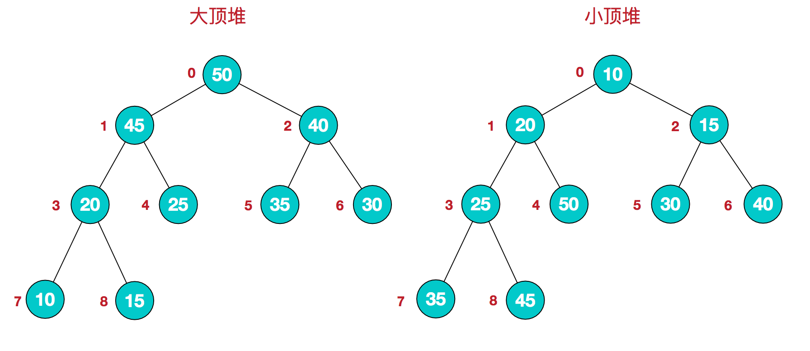
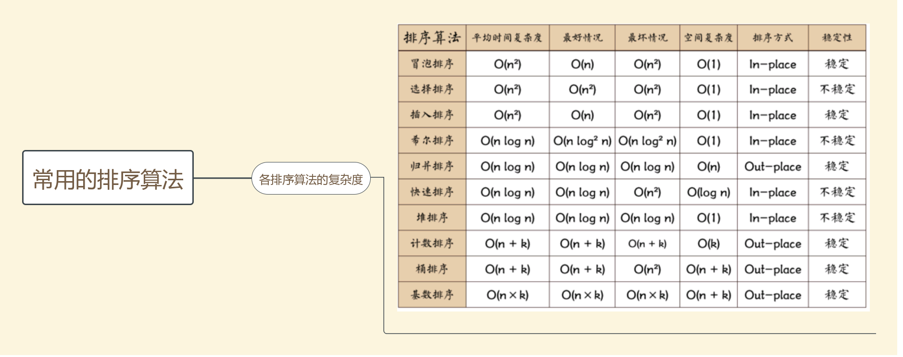

# 排序算法

- [排序算法](#%e6%8e%92%e5%ba%8f%e7%ae%97%e6%b3%95)
  - [堆排序](#%e5%a0%86%e6%8e%92%e5%ba%8f)
    - [堆的定义](#%e5%a0%86%e7%9a%84%e5%ae%9a%e4%b9%89)
    - [堆排序的基本思想](#%e5%a0%86%e6%8e%92%e5%ba%8f%e7%9a%84%e5%9f%ba%e6%9c%ac%e6%80%9d%e6%83%b3)
    - [代码实现(c++)](#%e4%bb%a3%e7%a0%81%e5%ae%9e%e7%8e%b0c)
    - [算法复杂度](#%e7%ae%97%e6%b3%95%e5%a4%8d%e6%9d%82%e5%ba%a6)
  - [快速排序](#%e5%bf%ab%e9%80%9f%e6%8e%92%e5%ba%8f)
    - [基本思想](#%e5%9f%ba%e6%9c%ac%e6%80%9d%e6%83%b3)
    - [代码实现(c++)](#%e4%bb%a3%e7%a0%81%e5%ae%9e%e7%8e%b0c-1)
    - [快速排序优化](#%e5%bf%ab%e9%80%9f%e6%8e%92%e5%ba%8f%e4%bc%98%e5%8c%96)
    - [时间与空间复杂度](#%e6%97%b6%e9%97%b4%e4%b8%8e%e7%a9%ba%e9%97%b4%e5%a4%8d%e6%9d%82%e5%ba%a6)
  - [归并排序](#%e5%bd%92%e5%b9%b6%e6%8e%92%e5%ba%8f)
    - [基本思想](#%e5%9f%ba%e6%9c%ac%e6%80%9d%e6%83%b3-1)
    - [代码实现](#%e4%bb%a3%e7%a0%81%e5%ae%9e%e7%8e%b0)
    - [时间与空间复杂度](#%e6%97%b6%e9%97%b4%e4%b8%8e%e7%a9%ba%e9%97%b4%e5%a4%8d%e6%9d%82%e5%ba%a6-1)
  - [冒泡排序](#%e5%86%92%e6%b3%a1%e6%8e%92%e5%ba%8f)
    - [代码实现](#%e4%bb%a3%e7%a0%81%e5%ae%9e%e7%8e%b0-1)
    - [时间与空间复杂度](#%e6%97%b6%e9%97%b4%e4%b8%8e%e7%a9%ba%e9%97%b4%e5%a4%8d%e6%9d%82%e5%ba%a6-2)
  - [选择排序](#%e9%80%89%e6%8b%a9%e6%8e%92%e5%ba%8f)
    - [代码实现](#%e4%bb%a3%e7%a0%81%e5%ae%9e%e7%8e%b0-2)
    - [时间与空间复杂度](#%e6%97%b6%e9%97%b4%e4%b8%8e%e7%a9%ba%e9%97%b4%e5%a4%8d%e6%9d%82%e5%ba%a6-3)
  - [排序算法的稳定性](#%e6%8e%92%e5%ba%8f%e7%ae%97%e6%b3%95%e7%9a%84%e7%a8%b3%e5%ae%9a%e6%80%a7)
  - [常用算法总结](#%e5%b8%b8%e7%94%a8%e7%ae%97%e6%b3%95%e6%80%bb%e7%bb%93)

## 堆排序

### 堆的定义  

<p style="text-indent: 2em">堆是具有以下性质的完全二叉树：每个结点的值都大于或等于其左右孩子结点的值，称为大顶堆；或者每个结点的值都小于或等于其左右孩子结点的值，称为小顶堆</p>

  

对应的数组表示分别为  
`大顶堆[50,45,40,20,25,35,30,10,15]  arr[i] >= arr[2i+1] && arr[i] >= arr[2i+2]`  
`小顶堆[10,20,15,25,50,30,40,35,45] arr[i] <= arr[2i+1] && arr[i] <= arr[2i+2]`  

### 堆排序的基本思想  

1. 将无需序列构建成一个堆，根据升序降序需求选择大顶堆或小顶堆;
2. 将堆顶元素与末尾元素交换，将最大元素"沉"到数组末端;
3. 重新调整结构，使其满足堆定义，然后继续交换堆顶元素与当前末尾元素，反复执行调整+交换步骤，直到整个序列有序  

### 代码实现(c++)

```c++
void heapSort(int* a, int size) {
    for(int i = 0; i < size; i++) {
        createHeap(a, size, size - 1- i);
        swap(a[0], a[size - 1 -i]);
    }


}

void createHeap(int* a, int size, int lastIndex) {
    for(int i = size / 2 - 1;i >= 0;i--) {
        int t = i;
        while(t * 2 + 1 <= lastIndex) {
            int bigIndex = t * 2 + 1;
            if(bigIndex < lastIndex && a[bigIndex] < a[bigIndex+1]) {
                bigIndex++;
            }
            if(a[t] < a[bigIndex]) {
                swap(a[t], a[bigIndex]);
                t = bigIndex;
            } else {
                break;
            }
        }
    }
}

void swap(int& a, int& b) {
    int temp = a;
    a = b;
    b = temp;
}
```

### 算法复杂度  

堆排序是选择排序的一种，属于不稳定排序，构建初始堆的复杂度为O(n)，最坏、最好、平均时间复杂度均为O(nlogn), 空间复杂度为O(1)

## 快速排序

### 基本思想

快速排序采用分治的思想，首先选取一个基准点pivot，将小于该基准点的移到基准点的左侧，将大于该基准点的移到基准点的右侧，对左侧和右侧的部分分别进行快速排序  

### 代码实现(c++)
```c++
void quickSort(int* a , int l , int r) {
    if(l < r) {
        int pivot = partition(a, l, r);
        quickSort(a, pivot+1, r);
        quickSort(a, l, pivot - 1);  
    }
}
int partition(int* a, int l , int r) {
    int pivot = a[l]; // 以左边第一个数作为基准，将所有大于它的值移到右侧，所有小于它的值移到左侧
    while(l < r) {
        while(l < r && a[r] >= pivot) {
            r--;
        }
        swap(a[l], a[r]);
        while(l < r && a[l] <= pivot) {
            l++;
        }
        swap(a[l], a[r]);
    }
    return l;
}
void swap(int& a, int& b) {
    int temp = a;
    int a = b;
    int b = temp;
}

```

### 快速排序优化
 1. 枢轴选取方式的优化  
   (1)固定位置选取(上面的实现，相当于未优化的初始方案, 当原始数组有序时，每次待排序数组长度仅减一，时间复杂度到达最坏情况O(n2))  
   (2)随机位置选取 
   ```c++
   #include <stdlib.h>
   #include <time.h>
   void quickSort(int* a, int l, int r) {
       srand((unsigned int)time(NULL))
       ........
   }

   int partition(int* a, int l, int r) {
       swap(a[l], a[rand() % (r - l + 1) + l]);
       ........
   }
   ```
   (3)三值取中法
   ```c++
   int getMedianofThree(int* a, int l, int r) {
       int median = (l + r) / 2;
       if(a[l] > a[r]) {
           swap(a[l], a[r]);
       }
       if(a[median] > a[r]) {
           swap(a[median], a[r]);
       }
       if(a[l] < a[median]) {
           swap(a[l], a[median]);
       }
       return a[l];
   }
   ```
2. 插入排序的优化(划分区间很小时，快排效率低)
   ```c++
   void insertSort(int* a, int l, int r) {
       for(int i = l + 1; i <= r; i++) {
           int tmp = a[i];
           int j = i - 1;
           for(; j >= l && a[j] > tmp; j--) {
               a[j+1] = a[j];
           }
           a[j+1] = tmp;
       }
   }
   void quickSort(int* a, int l, int r) {
       if(l < r) {
           if(r - l + 1 < 10) insertSort(a, l , r);
           else {
               ......
           }
       }
   }
   ```
3. 尾递归优化(减小栈的深度,空间复杂度由O(n)->O(logn))  
   ```c++
   void quickSort(int* a, int l , int r) {
       while(l < r) {
        int pivot = partition(a, l, r);
        quickSort(a, l, pivot - 1);
        l = pivot + 1;
       }
   }
   ```
4. 聚集元素(待实现)
5. 多线程处理快排(待实现)

### 时间与空间复杂度

快速排序的时间复杂度最坏为O(n2), 最好为O(nlogn), 平均为O(nlogn), 空间复杂度最坏为O(n), 最好为O(logn),平均为O(logn)

## 归并排序

### 基本思想

归并排序采用分治的思想，将数组分为两部分后分别排序，再将两个有序数组合并为一个有序数组

### 代码实现

```c++
 void mergeSort(int* a, int l, int r, int* temp) {
     if(l < r) {
         int median = (l + r) / 2;
         mergeSort(a, l, median, temp);
         mergeSort(a, median+1, r, temp);
         merge(a, l, median, r, temp);
     }
 }
 void merge(int* a, int l, int median, int r, int* temp) {
     int left = l;
     int right = median + 1;
     int t = 0;
     while(left <= median && right <= r) {
         if(a[left] < a[right]) {
             temp[t++] = a[left++];
         } else {
             temp[t++] = a[right++];
         }
     }
     while(left <= median) {
         temp[t++] = a[left++];
     }
     while(right <= r) {
         temp[t++] = a[right++];
     }
     t = 0;
     while(l <= r) {
         a[l++] = temp[t++];
     }
 }
```

### 时间与空间复杂度

最好、最坏、平均时间复杂度均为O(nlogn) 空间复杂度O(n)

## 冒泡排序

### 代码实现
```c++
void bubbleSort(int* a, int size) {
    for (int i = 0; i < size; i++) {
            bool flag = true;//设定一个标记，若为true，则表示此次循环没有进行交换，也就是待排序列已经有序，排序已然完成。
            for (int j = 0; j < size - 1 - i; j++) {
                if (a[j] > a[j + 1]) {
                    swap(a[j], a[j+1]);
                    flag = false;
                }
            }
            if (flag) {
                break;
            }
        }
}
```

### 时间与空间复杂度

时间复杂度O(n2) 空间复杂度O(1)

## 选择排序

### 代码实现

```c++
void selectSort(int* a, int size) {
    for (int i = 0; i < size; i++) {
            int min = i;//每一趟循环比较时，min用于存放较小元素的数组下标，这样当前批次比较完毕最终存放的就是此趟内最小的元素的下标，避免每次遇到较小元素都要进行交换。
            for (int j = i + 1; j < size; j++) {
                if (a[j] < a[min]) {
                    min = j;
                }
            }
            //进行交换，如果min发生变化，则进行交换
            if (min != i) {
                swap(a[min],a[i]);
            }
        }
}
```

### 时间与空间复杂度

时间复杂度O(n2) 空间复杂度O(1)

## 排序算法的稳定性

定义: 保证排序前2个相等的数其在序列的前后位置顺序和排序后它们两个的前后位置顺序相同

 稳定排序:冒泡排序、归并排序、插入排序  
 不稳定排序: 堆排序、快速排序、选择排序

 ## 常用算法总结

 
