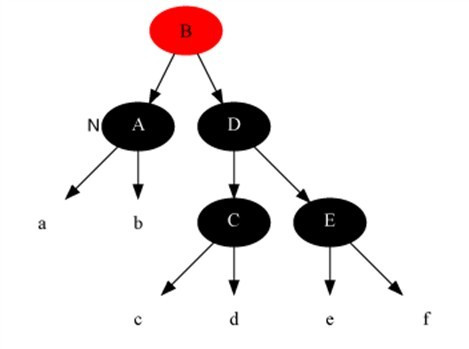
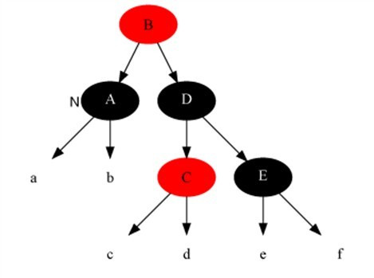

# 查找

- [查找](#%e6%9f%a5%e6%89%be)
  - [二叉查找树(BST)](#%e4%ba%8c%e5%8f%89%e6%9f%a5%e6%89%be%e6%a0%91bst)
    - [特性](#%e7%89%b9%e6%80%a7)
    - [时间复杂度](#%e6%97%b6%e9%97%b4%e5%a4%8d%e6%9d%82%e5%ba%a6)
    - [代码实现](#%e4%bb%a3%e7%a0%81%e5%ae%9e%e7%8e%b0)
  - [二叉平衡树(AVL)](#%e4%ba%8c%e5%8f%89%e5%b9%b3%e8%a1%a1%e6%a0%91avl)
    - [特性](#%e7%89%b9%e6%80%a7-1)
    - [失衡调整](#%e5%a4%b1%e8%a1%a1%e8%b0%83%e6%95%b4)
      - [插入时的失衡调整](#%e6%8f%92%e5%85%a5%e6%97%b6%e7%9a%84%e5%a4%b1%e8%a1%a1%e8%b0%83%e6%95%b4)
      - [删除时的失衡调整](#%e5%88%a0%e9%99%a4%e6%97%b6%e7%9a%84%e5%a4%b1%e8%a1%a1%e8%b0%83%e6%95%b4)
    - [代码实现](#%e4%bb%a3%e7%a0%81%e5%ae%9e%e7%8e%b0-1)
    - [AVL树的优劣与适用场景](#avl%e6%a0%91%e7%9a%84%e4%bc%98%e5%8a%a3%e4%b8%8e%e9%80%82%e7%94%a8%e5%9c%ba%e6%99%af)
    - [AVL树的约束](#avl%e6%a0%91%e7%9a%84%e7%ba%a6%e6%9d%9f)
  - [红黑树(RBT)](#%e7%ba%a2%e9%bb%91%e6%a0%91rbt)
    - [特性](#%e7%89%b9%e6%80%a7-2)
    - [应用](#%e5%ba%94%e7%94%a8)
    - [失衡调整](#%e5%a4%b1%e8%a1%a1%e8%b0%83%e6%95%b4-1)
      - [插入时失衡](#%e6%8f%92%e5%85%a5%e6%97%b6%e5%a4%b1%e8%a1%a1)
      - [插入修复伪代码](#%e6%8f%92%e5%85%a5%e4%bf%ae%e5%a4%8d%e4%bc%aa%e4%bb%a3%e7%a0%81)
      - [删除失衡修复](#%e5%88%a0%e9%99%a4%e5%a4%b1%e8%a1%a1%e4%bf%ae%e5%a4%8d)
    - [代码实现](#%e4%bb%a3%e7%a0%81%e5%ae%9e%e7%8e%b0-2)
    - [红黑树的约束](#%e7%ba%a2%e9%bb%91%e6%a0%91%e7%9a%84%e7%ba%a6%e6%9d%9f)
  - [B树](#b%e6%a0%91)
    - [特性](#%e7%89%b9%e6%80%a7-3)
    - [B树插入](#b%e6%a0%91%e6%8f%92%e5%85%a5)
  - [B+树(数据库索引)](#b%e6%a0%91%e6%95%b0%e6%8d%ae%e5%ba%93%e7%b4%a2%e5%bc%95)
  - [数据库索引选择原理](#%e6%95%b0%e6%8d%ae%e5%ba%93%e7%b4%a2%e5%bc%95%e9%80%89%e6%8b%a9%e5%8e%9f%e7%90%86)

## 二叉查找树(BST)

### 特性

根结点的值总是大于左子树的值，小于右子树的值

### 时间复杂度

在二叉查找树中，查找次数为树的深度h。最好的情况为满二叉树, 对于n个数来说，若满二叉树深度为h, 则满足n = 2的h次方 - 1(等比数列)， 查找次数h = logn，时间复杂度为O(logn),最坏的情况是结点按递增顺序插入，此时二叉树深度为n，时间复杂度为O(n)  
二叉查找树插入、查找、删除的时间复杂度一致

### 代码实现

查找: 从根结点开始比较，若等于就找到，小于往左走，大于往右做，重复这个过程。若走到了空结点，说明值不存在  
插入: 先执行查找，若找到了则不用插入直接返回;若没有找到则以最后一个结点作为父结点，小于它则插到左边，大于它则插到右边  
删除: 先执行查找，若没有找到则不用删除直接返回;若找到了选择合适的结点来代替删除结点的位置，共有三种情况需要考虑:

1. 如果删除的结点没有右孩子，那么就选择它的左孩子来代替原来的结点
2. 如果被删除结点的右孩子没有左孩子，那么这个右孩子被用来替换被删除结点
3. 如果被删除结点的右孩子有左孩子，就需要用被删除结点右孩子的左子树中的最下面的结点来替换它，即用被删除结点的右子树中最小值的结点来替换。

```c++
template<class ElemType>
typedef struct node {
    ElemType data;
    struct node *lchild, *rchild;
    node(ElemType d): data(d), lchiild(NULL), rchild(NULL) {}
}*BST;
//插入元素
bool insertBST(BST &T, ElemType element) { //指针的引用，直接修改了left,right的值
    if (T==NULL)
    {
        T = new node(element);
        return true;
    }
    if (T->data == element) {//元素的值不能和树中已有的值相等 
        return false;
    }
    if (T->data > element) {
        insertBST(T->lchild,element);
    } else {
        insertBST(T->rchild,element);
    }
}

void recursiveSearch(BST T, ElemType element, BST &result) {
    if(T == NULL || T->data == element) {
        result = T;
        return;
    }

    if(T->data > element) {
        search(T->lchild, element, result);
    } else {
        search(T->rchild, data);
    }
}

void serach(BST T, ElemType element, BST &result) {
    while(T != NULL) {
        if(T->data == element) {
            result = T;
            return;
        }
        if(T->data > element) {
            T = T->lchild;
        } else {
            T = T->rchild;
        }
    }
}

//创建二叉排序树
void createBST(BST &T,ElemType* array,int len){
    T = NULL;
    for (int i = 0; i < len; i++) {
        insertBST(T,array[i]);
    }
}
//释放内存
void relese(BST &T) {
    if (T==NULL) {
        return;
    }
    relese(T->lchild);
    relese(T->rchild);
    delete T;
}
//删除某个结点
bool deleteNode(BST &T, ElemType element) {
    if (T == NULL) {
        return false;
    }
    BST p,q,s,parent;
    p = T;
    while (p != NULL)
    {
        if (p->data == element)  break;
        parent = p;
        p = (p->data < element) ? p->rchild: p->lchild;
    }
    if (p == NULL) return false;
    if (p->lchild == NULL && p->rchild == NULL) {
    //重置其父亲结点的左右子孩子
        if (parent->lchild != NULL && parent->lchild->data == element)
        {
            parent->lchild = NULL;
        }
        if (parent->rchild != NULL && parent->rchild->data == element)
        {
            parent->rchild = NULL;
        }
        return true;
    } else if (p->rchild == NULL) {
        //要让p的左孩子接上
        s = p->lchild;
        p->data = s->data;
        p->lchild = s->lchild;
        p->rchild = s->rchild;
        delete s;
        return true;
    } else if (p->rchild->lchild == NULL) {
        //接上p的右孩子
        s = p->rchild;
        p->data = s->data;
        p->rchild = s->rchild;
        delete s;
        return true;
    } else {
        q = p;
        s = p->rchild;
        while (s->lchild != NULL) {
            q = s;
            s = s->lchild;
        }
        p->data = s->data;
        q->lchild = s->rchild;
        delete s;
        return true;
    }
}
```

## 二叉平衡树(AVL)

### 特性

1. 可以是空树
2. 假如不是空树，任何一个结点的左子树与右子树都是平衡二叉树，并且高度之差的绝对值不超过1  
平衡因子: 左子树的高度减去右子树的高度。由平衡二叉树的定义可知，平衡因子的取值只可能为-1,0,1 分别对应右子树比较高、左右子树等高、左子树比较高。以L表示左子树较高，R表示右子树较高，E表示左右子树相等

### 失衡调整

右子树过高 左旋: 原来根结点A的右孩子R作为新的根结点，原来根结点A作为右孩子R的左孩子，原来右孩子R的左孩子L作为原来根结点A的右孩子

左子树过高 右旋: 原来根结点A的左孩子L作为新的根结点， 原来根结点A作为左孩子L的右孩子，原来左孩子L的右孩子R作为原来根结点A的左孩子

#### 插入时的失衡调整

寻找最小不平衡子树(平衡因子绝对值为2)，以及该子树的较高子树(深度加1)，以这两个子树根结点的平衡因子来表示不同的失衡情况，可分为LL型、LR型、RR型

LL型

旋转方法: 以最小不平衡树的根(图中的3)为中心右旋

LR型

旋转方法  以较高子树的根(图中的1)为中心左旋
  
然后以最小不平衡树的根(图中的3)为中心右旋

RR型

旋转方法 以最小不平衡树的根(图中的1)为中心左旋

RL型

旋转方法  以较高子树的根(图中的1)为中心右旋
  
然后以最小不平衡树的根(图中的3)为中心左旋

#### 删除时的失衡调整

*先验知识 对最小不平衡子树的调整可能会降低最小不平衡子树的高度*

删除结点的分析

1. 若左右子树高度相当，删除结点后仍是平衡的
2. 若左右子树高度不相等且删除结点在较高子树上，删除结点后仍是平衡的
3. 若左右子树高度不相等且删除结点在较低子树上，删除结点后产生最小不平衡子树，平衡处理完后最小不平衡子树高度降低，有可能导致更大的不平衡树，即在较矮的子树上进行了平衡处理  
如下图删除结点6，对较矮的左子树平衡处理后产生了更大的不平衡树，并且是RE型，这种情况与RR型旋转相同


### 代码实现

跳转地址 [二叉平衡树](https://github.com/wsx66848/Algorithms/tree/master/AVL)


### AVL树的优劣与适用场景

AVL树与普通的二叉搜索树相比，左右子树较为平衡，树的深度较低，减少了树的平均搜索长度，插入、查找和删除在平均和最坏的情况下均为O(logn)。劣势是AVL树是严格的高度平衡树，维持高度平衡的旋转操作所付出的开销较大，适用于插入与删除次数较少，查找多的场景。

### AVL树的约束

* 一棵n个结点的AVL树的其高度保持在0(log2(n)),不会超过3/2log2(n+1) 
* 一棵n个结点的AVL树的平均搜索长度保持在0(log2(n))
* 一棵n个结点的AVL树删除一个结点做平衡化旋转所需要的时间为0(log2(n))
* 查找的时间复杂度维持在O(logN)，不会出现最差情况
* AVL树在执行每个插入操作时最多需要1次旋转，其时间复杂度在O(logN)左右(查找位置所花费的时间)
* AVL树在执行删除时代价稍大，执行每个删除操作的时间复杂度需要O(2logN)(查找位置索所花费的时间O(logn) + 删除后旋转操作的时间,可能会一直旋转到根结点，所以删除操作的次数就与树的高度有关O(logn))

## 红黑树(RBT)

### 特性

一种二叉查找树，但在每个结点增加一个存储位表示结点的颜色，可以是红或黑（非红即黑）。通过对任何一条从根到叶子的路径上各个结点着色的方式的限制，红黑树确保没有一条路径会比其它路径长出两倍，因此，红黑树是一种弱平衡二叉树（由于是弱平衡，在相同的结点情况下，AVL树的高度低于红黑树），相对于要求严格的AVL树来说，它的旋转次数少，所以对于搜索，插入，删除操作较多的情况下，红黑树更为适用

* 性质1 每个结点要么是红的要么是黑的
* 性质2 根结点是黑的
* 性质3 每个叶结点（叶结点即指树尾端NIL指针或NULL结点）都是黑的  
* 性质4 如果一个结点是红的，那么它的两个儿子都是黑的
* 性质5 对于任意结点而言，其到叶结点树尾端NIL指针的每条路径都包含相同数目的黑结点 

### 应用

* 广泛用于C ++的STL中，地图和集都是用红黑树实现的;

* Linux的的进程调度完全公平调度程序，用红黑树管理进程控制块，进程的虚拟内存区域都存储在一颗红黑树上，每个虚拟地址区域都对应红黑树的一个节点，左指针指向相邻的地址虚拟存储区域，右指针指向相邻的高地址虚拟地址空间;

* IO多路复用的epoll的的的实现采用红黑树组织管理的的的sockfd，以支持快速的增删改查;

* Nginx的的的中用红黑树管理定时器，因为红黑树是有序的，可以很快的得到距离当前最小的定时器;

* Java的的的中TreeMap中的中的实现;

* 关联数组

### 失衡调整

#### 插入时失衡

插入时先按二叉查找树的方式插入，将插入的结点涂为红色，将左右两个NULL结点涂为黑色。若插入的结点为根结点，则将颜色改为黑色；若插入结点的父结点颜色是黑色，符合红黑树的性质，不作调整；若插入结点的父结点颜色是红色，此时需做调整  
* 插入修复情况1：如果当前结点的父结点是红色且祖父结点的另一个子结点（叔叔结点）是红色
* 插入修复情况2：当前结点的父结点是红色,叔叔结点是黑色，当前结点是其父结点的右子
* 插入修复情况3：当前结点的父结点是红色,叔叔结点是黑色，当前结点是其父结点的左子

插入修复情况1：将当前结点的父结点和叔叔结点涂黑，祖父结点涂红，把当前结点指向祖父结点，从新的当前结点重新开始算法(图中的15应为13，下同)  

  
插入修复情况1转换为了插入修复情况2：当前结点的父结点做为新的当前结点，以新当前结点为支点左旋  
  
插入修复情况2转换为了插入修复情况3：父结点变为黑色，祖父结点变为红色，在祖父结点为支点右旋
  
至此插入修复完成

#### 插入修复伪代码

左旋
```python
LeftRoate(T, x)
y ← x.right				       //定义y：y是x的右孩子
x.right ← y.left	            //y的左孩子成为x的右孩子
if y.left ≠ T.nil
    y.left.p ← x	
y.p ← x.p				       //x的父结点成为y的父结点
if x.p = T.nil
	then T.root ← y
else if x = x.p.left
	then x.p.left ← y
else x.p.right ← y 
y.left ← x                       //x作为y的左孩子
x.p ← y
```
红黑树插入
```python
RB-INSERT(T, z)
y ← nil
x ← T.root
while x ≠ T.nil
	do y ← x
	if z.key < x.key
		then x ← x.left
	else x ← x.right
z.p ← y
if y == nil[T]
	then T.root ← z
else if z.key < y.key
	then y.left ← z
else y.right ← z
z.left ← T.nil
z.right ← T.nil
z.color ← RED
RB-INSERT-FIXUP(T, z)
```
插入修复
```python
RB-INSERT-FIXUP(T, z)
while z.p.color == RED
	do if z.p == z.p.p.left
		then y ← z.p.p.right
		if y.color == RED
			then z.p.color ← BLACK               ▹ Case 1
			y.color ← BLACK                    ▹ Case 1
			z.p.p.color ← RED                    ▹ Case 1
			z ← z.p.p                            ▹ Case 1
		else if z == z.p.right
			then z ← z.p                          ▹ Case 2
			LEFT-ROTATE(T, z)                   ▹ Case 2
		z.p.color ← BLACK                        ▹ Case 3
		z.p.p.color ← RED                         ▹ Case 3
		RIGHT-ROTATE(T, z.p.p)                  ▹ Case 3
	else (same as then clause with "right" and "left" exchanged)
T.root.color ← BLACK
```

#### 删除失衡修复

先按照二叉树删除结点的方式删除结点。如果删除的是红色结点，则红黑树的性质不变；如果删除的是黑色结点，那么红黑树的性质在以下几种情况下会发生变化
* 如果删除结点不是树唯一结点，那么删除结点的那一个支的到各叶结点的黑色结点数会发生变化，此时性质5被破坏
* 如果被删结点的唯一非空子结点是红色，而被删结点的父结点也是红色，那么性质4被破坏
* 如果被删结点是根结点，而它的唯一非空子结点是红色，则删除后新根结点将变成红色，违背性质2

在删除黑色结点时，可以认为改黑色被它的子结点所继承，这样分支中的黑色数量没有减少，性质5没有被破坏。如果子结点原来是红色，那么现在的颜色是红色+黑色；如果子结点原来是黑色，那么现在的颜色是黑色+黑色  
无需旋转的两种情况
1. 红色+黑色  直接把红色染成黑色，所有性质恢复
2. 黑色+黑色 且被删除结点是根结点 什么都不做

需要旋转的四种情况
1. 删除修复情况1：当前结点是黑+黑且兄弟结点为红色(此时父结点和兄弟结点的子结点分为黑)
2. 删除修复情况2：当前结点是黑加黑且兄弟是黑色且兄弟结点的两个子结点全为黑色
3. 删除修复情况3：当前结点颜色是黑+黑，兄弟结点是黑色，兄弟的左子是红色，右子是黑色
4. 删除修复情况4：当前结点颜色是黑+黑色，它的兄弟结点是黑色，但是兄弟结点的右子是红色，兄弟结点左子的颜色任意

* 删除修复情况1解法: 把父结点染成红色，把兄弟结点染成黑色，以父结点为支点左旋，之后重新进入算法（我们只讨论当前结点是其父结点左孩子时的情况）。此变换后原红黑树性质5不变，而把问题转化为兄弟结点为黑色的情况(注：变化前，原本就未违反性质5，只是为了把问题转化为兄弟结点为黑色的情况)  


* 删除修复情况2解法: 把当前结点和兄弟结点中抽取一重黑色追加到父结点上，把父结点当成新的当前结点，重新进入算法。（此变换后性质5不变）


* 删除修复情况3解法: 把兄弟结点染红，兄弟左子结点染黑，之后再在兄弟结点为支点解右旋，之后重新进入算法。此是把当前的情况转化为情况4，而性质5得以保持


* 删除修复情况4解法: 把兄弟结点染成当前结点父结点的颜色，把当前结点父结点染成黑色，兄弟结点右子染成黑色，之后以当前结点的父结点为支点进行左旋，此时算法结束，红黑树所有性质调整正确  


### 代码实现

跳转地址 [红黑树](https://github.com/wsx66848/RB_Tree)

### 红黑树的约束

* 红黑树结点数与数高的约束 lg(n+1) >= h/2
* 最长路径长度不超过最短路径长度的2倍
* 查找效率最好情况下时间复杂度为O(logN)，但在最坏情况下(最长路径长度是最短路径长度2倍 - 1 )比AVL要差一些，但也远远好于BST。
* 插入和删除操作改变树的平衡性的概率要远远小于AVL（RBT不是高度平衡的）。因此需要的旋转操作的可能性要小，而且一旦需要旋转，插入一个结点最多只需要旋转2次，删除最多只需要旋转3次(小于AVL的删除操作所需要的旋转次数)。虽然变色操作的时间复杂度在O(logN)，但是实际上，这种操作由于简单所需要的代价很小。

## B树

### 特性

B树也成B-树，是一颗多路平衡查找树，B树的阶数表示了一个结点最多拥有多少个孩子结点，一般用字母m表示。当m=2时，就是二叉查找树。
一个m阶B树的定义如下:
* 每个结点最多有m-1个关键字
* 根结点最少可以只有1个关键字。
* 非根结点至少有Math.ceil(m/2)-1个关键字。
* 每个结点中的关键字都按照从小到大的顺序排列，每个关键字的左子树中的所有关键字都小于它，而右子树中的所有关键字都大于它。
* 所有叶子结点都位于同一层，或者说根结点到每个叶子结点的长度都相同

上图是阶数为4的B数。B树的每个结点中存储了关键字Key和对应的数字data，一个关键字Key和data就是一条记录。B树是为了存储设备和磁盘而设计的多路平衡查找树，数据库中使用B树(B+树)作为字段的索引，Key表示键，data表示键对应的条目在硬盘上的逻辑地址

### B树插入

插入操作是指插入一条记录，即（key, value）的键值对。如果B树中已存在需要插入的键值对，则用需要插入的value替换旧的value。若B树不存在这个key,则一定是在叶子结点中进行插入操作。

1. 根据要插入的key的值，找到叶子结点并插入。

2. 判断当前结点key的个数是否小于等于m-1，若满足则结束，否则进行第3步。

3. 以结点中间的key为中心分裂成左右两部分，然后将这个中间的key插入到父结点中，这个key的左子树指向分裂后的左半部分，这个key的右子支指向分裂后的右半部分，然后将当前结点指向父结点，返回第2步。

在实现B树的代码中，为了使代码编写更加容易，我们可以将结点中存储记录的数组长度定义为**m**而非m-1，这样方便底层的结点由于分裂向上层插入一个记录时，上层有多余的位置存储这个记录。同时，每个结点还可以存储它的父结点的引用，这样就不必编写递归程序  
*如果记录先按key的大小排好序，再插入到B树中，结点的使用率就会很低，最差情况下使用率仅为50%*

## B+树(数据库索引)

B+树真正用于数据库索引，其是B树的变体，区别在于:
* 非叶子节点的子树指针与关键字个数相同，即m阶的B+树每个结点拥有m个关键字, m个子指针 如果此B+树的阶数是m，则除了根之外的每个节点都包含最少ceil(m/2)个元素
* 非叶子结点的子树指针P[i], 指向关键字值属于[K[i], k[i+1])的子树(左闭右开区间)
* 所有的叶子结点中包含了全部关键字的信息(所有的关键字信息都在叶子节点出现)，及指向含有这些关键字记录的指针(硬盘上的逻辑地址)，且叶子结点本身依关键字的大小自小而大的顺序链接。所有非叶子结点即内部结点，本身只存储索引，不存储指向关键字具体信息的指针

## 数据库索引选择原理
Mysql的数据库索引使用**B+树**
Q1: 为什么不适用BST,AVL或者RBT?  
A1: 这是因为大规模的数据构建的索引树很大，不可能全部存储在内存中，因此索引通常以索引文件的方式存储在磁盘上。而二叉树每个结点只能存储一个关键字信息，这样树的深度很大，在查找操作中需要从磁盘中读取多个结点，每次i/o读取一个结点，这样导致二叉查找树结构由于树的深度过大而造成磁盘I/O读写过于频繁，进而导致查询效率低下，因此我们该想办法降低树的深度，从而减少磁盘查找存取的次数。而B+树这样的多叉树一个结点可以存储多个关键字，树的深度较小。  

Q2: 为什么不适用哈希索引?  
A2: 哈希索引不支持范围查询  

Q3: 为什么B+比B树更适合作为索引  
A3: 
* B+-tree的磁盘读写代价更低 B+tree的内部结点并没有指向关键字具体信息的指针。因此其内部结点相对B 树更小。如果把所有同一内部结点的关键字存放在同一盘块中，那么盘块所能容纳的关键字数量也越多。一次性读入内存中的需要查找的关键字也就越多。相对来说IO读写次数也就降低了。举个例子，假设磁盘中的一个盘块容纳16bytes，而一个关键字2bytes，一个关键字具体信息指针2bytes。一棵9阶B-tree(一个结点最多8个关键字)的内部结点需要2个盘块。而B+ 树内部结点只需要1个盘快。当需要把内部结点读入内存中的时候，B 树就比B+ 树多一次盘块查找时间(在磁盘中就是盘片旋转的时间)。

* B+-tree的查询效率更加稳定
由于非终结点并不是最终指向文件内容的结点，而只是叶子结点中关键字的索引。所以任何关键字的查找必须走一条从根结点到叶子结点的路。所有关键字查询的路径长度相同，导致每一个数据的查询效率相当。

总而言之，B树在提高了磁盘IO性能的同时并没有解决元素遍历的效率低下的问题。正是为了解决这个问题，B+树应运而生。B+树只要遍历叶子节点就可以实现整棵树的遍历，支持基于范围的查询，而B树不支持range-query这样的操作（或者说效率太低）

> 无论是B树，还是B+树、b*树(空间使用率比B树高)，由于根或者树的上面几层被反复查询，所以这几块可以存在内存中，换言之，B树、B+树、B_树的根结点和部分顶层数据在内存中，大部分下层数据在磁盘上