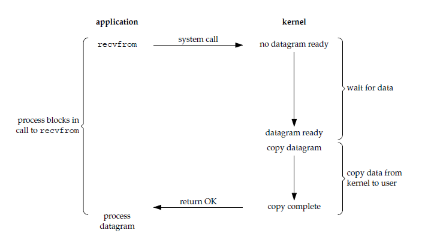

# Socket

- [Socket](#socket)
  - [五种io模式](#%e4%ba%94%e7%a7%8dio%e6%a8%a1%e5%bc%8f)
    - [blocking io](#blocking-io)
    - [Non-blocking io](#non-blocking-io)
    - [I/O复用](#io%e5%a4%8d%e7%94%a8)
    - [信号io](#%e4%bf%a1%e5%8f%b7io)
    - [异步io](#%e5%bc%82%e6%ad%a5io)
    - [五大io比较](#%e4%ba%94%e5%a4%a7io%e6%af%94%e8%be%83)
  - [select, poll, epoll](#select-poll-epoll)
    - [比较](#%e6%af%94%e8%be%83)
    - [epoll的两种工作模式](#epoll%e7%9a%84%e4%b8%a4%e7%a7%8d%e5%b7%a5%e4%bd%9c%e6%a8%a1%e5%bc%8f)
    - [应用场景](#%e5%ba%94%e7%94%a8%e5%9c%ba%e6%99%af)
  - [io多路复用与non-blocking io](#io%e5%a4%9a%e8%b7%af%e5%a4%8d%e7%94%a8%e4%b8%8enon-blocking-io)

## 五种io模式

io操作时发生系统调用system call，中断当前应用进程陷入内核态，整个过程可分为两个阶段:  

1. 等待内核kernel将数据准备好
2. 将数据从内核缓冲区拷贝到应用进程缓冲区

io模式的分类可根据这两个阶段是否阻塞来分类

### blocking io

第一阶段阻塞 + 第二阶段阻塞

### Non-blocking io

第一阶段没有数据就返回，第二阶段阻塞(需要一直轮询(polling))

### I/O复用

select poll epoll
使得单个进程具有处理多个i/o事件的能力，相比于多进程和多线程技术，I/O 复用不需要进程线程创建和切换的开销，系统开销更小

第一阶段阻塞 + 第二阶段阻塞

### 信号io

应用进程使用 sigaction 系统调用，内核立即返回，应用进程可以继续执行，也就是说等待数据阶段应用进程是非阻塞的。内核在数据到达时向应用进程发送 SIGIO 信号，应用进程收到之后在信号处理程序中调用 recvfrom 将数据从内核复制到应用进程中。

相比于非阻塞式 I/O 的轮询方式，信号驱动 I/O 的 CPU 利用率更高。

### 异步io

应用进程执行 aio_read 系统调用会立即返回，应用进程可以继续执行，不会被阻塞，内核会在所有操作完成之后向应用进程发送信号。

异步 I/O 与信号驱动 I/O 的区别在于，异步 I/O 的信号是通知应用进程 I/O 完成，而信号驱动 I/O 的信号是通知应用进程可以开始 I/O。

### 五大io比较

* 同步io: 在将数据从内核缓冲区复制到应用进程缓冲区时，应用进程会阻塞
* 异步io: 第一和第二阶段都不会阻塞

同步io之间的区别在于第一阶段是否阻塞，非阻塞io和信号io在第一阶段不会阻塞

## select, poll, epoll

### 比较

* 功能
  1. select会修改描述符，poll、epoll不会
  2. select 的描述符类型使用数组实现，FD_SETSIZE 大小默认为 1024，因此默认只能监听少于 1024 个描述符。如果要监听更多描述符的话，需要修改 FD_SETSIZE 之后重新编译,而 poll、epoll 没有描述符数量的限制
  3. poll 提供了更多的事件类型，并且对描述符的重复利用上比select高
  4. 如果一个线程对某个描述符调用了 select 或者 poll，另一个线程关闭了该描述符，会导致调用结果不确定；epoll对多线程编程更加友好，一个线程调用了epoll_wait()另一个线程关闭了同一个描述符也不会产生不确定情况
* 速度  
   select, poll每次调用都需要将全部描述符从应用进程缓冲区拷贝到内核缓冲区，并且需要每次轮询全部描述符的状态，速度都比较慢；epoll在每次调用epoll_ctl()时向内核注册新的描述符或者是改变某个文件描述符的状态。已注册的描述符在内核中会被维护在一棵红黑树上，通过回调函数内核会将 I/O 准备好的描述符加入到一个链表中管理，进程调用 epoll_wait() 便可以得到事件完成的描述符。epoll 只需要将描述符从进程缓冲区向内核缓冲区拷贝一次，并且进程不需要通过轮询来获得事件完成的描述符，速度较快
* 可移植性
  几乎所有的系统都支持 select，但是只有比较新的系统支持 poll。epoll仅适用于Linux OS

### epoll的两种工作模式

LT(level trigger) ET(edge trigger)

1. LT 模式
当 epoll_wait() 检测到描述符事件到达时，将此事件通知进程，进程可以不立即处理该事件，下次调用 epoll_wait() 会再次通知进程。是默认的一种模式，并且同时支持 Blocking 和 No-Blocking。

2. ET 模式
和 LT 模式不同的是，通知之后进程必须立即处理事件，下次再调用 epoll_wait() 时不会再得到事件到达的通知。
很大程度上减少了 epoll 事件被重复触发的次数，因此效率要比 LT 模式高。只支持 No-Blocking，以避免由于一个文件句柄的阻塞读/阻塞写操作把处理多个文件描述符的任务饿死。

### 应用场景

epoll poll select都有各自的应用场景

1. select 应用场景
select 的 timeout 参数精度为微秒，而 poll 和 epoll 为毫秒，因此 select 更加适用于实时性要求比较高的场景，比如核反应堆的控制。
select 可移植性更好，几乎被所有主流平台所支持。

2. poll 应用场景
poll 没有最大描述符数量的限制，如果平台支持并且对实时性要求不高，应该使用 poll 而不是 select。

3. epoll 应用场景
只需要运行在 Linux 平台上，有大量的描述符需要同时轮询，并且这些连接最好是长连接。  
需要同时监控小于 1000 个描述符，就没有必要使用 epoll，因为这个应用场景下并不能体现 epoll 的优势。  
需要监控的描述符状态变化多，而且都是非常短暂的，也没有必要使用 epoll。因为 epoll 中的所有描述符都存储在内核中，造成每次需要对描述符的状态改变都需要通过 epoll_ctl() 进行系统调用，频繁系统调用降低效率。并且 epoll 的描述符存储在内核，不容易调试。

## io多路复用与non-blocking io

i/o 多路复用常与non-blocking io配合使用，原因在于blocking io可能会发生阻塞从而把处理多个描述符的任务饿死，原因如下:  

 1. 多路复用对于socket fd的扫描只会获取socket可读，但不知道具体有多少数据可读。如果需要一次读完全部数据，假设接收数组长度为n, 当全部可读数据不是n的整数倍时，可以通过判断当前读取字节数小于n从而break出循环;但是若全部可读数据是n的整数倍时，最后一次read就会阻塞应用进程。所以阻塞io每次读取只能读一次，无法知道下一次read会不会阻塞应用进程，这不适用于epoll的ET模式。而non-blocking io可以循环读取直到抛出EWOULDBLOCK或者EAGAIN异常，说明此时无数据可读，可以开始下一次扫描

 2. 当通知socket fd可读时，socket也不一定是真的可读，如校验和错误而被丢弃，或者没有设置好锁而被其他进程读取，这时blocking io会被直接阻塞

   >> Under Linux, select() may report a socket file descriptor as "ready for reading", while nevertheless a subsequent read blocks.  This could for example happen when       data has arrived but upon examination has wrong checksum and is discarded.  There may be other circumstances in which a file descriptor is spuriously reported  as       ready.  Thus it may be safer to use O_NONBLOCK on sockets that should not block.